# Installation de Hadoop sue WSL

## Prérequis
- Hyper-V activé (ou Hypervisor et Virtual Machine Platform)
- WSL2 activé

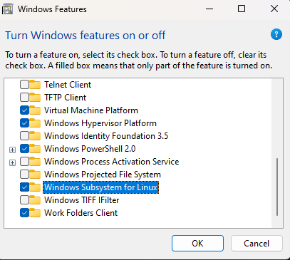


- Ubuntu installé sur WSL2


## Notes & Recommendations
1. DON'T SKIP A SINGLE STEP !
A chaque fois que vous avez un problème, vérifiez que vous avez bien suivi toutes les étapes précédentes. Si oui, cherchez la source de l'erreur sur internet, au pire des scénarios, revenez en arrière et recommencez.

>La majorité des problèmes d'installations sont liées soit à la machine soit au système d'exploitation installé.

2. Si vous avez déjà un WSL, désinstallez et réinstallez le. (C'est ce que j'ai fait pour que ça marche)

3. Pour chaque démarrage de hadoop, je m'assure que j'ai formatté les datanodes. Certes c'est long, mais ça évite les problèmes de permissions, de conflit et surtout DU NON DÉMARRAGE DE DATANODE.

4. Il est fréquent de tomber dans des erreurs dans le démarrage du SSH, encore une fois, ces problèmes sont liés à la machine et au système d'exploitation et non à l'installation.

5. Bien lire et comprendre les erreurs, elles sont souvent explicites.

> **IMPORTANT** :
> Bien que j'ai installé hadoop-3.3.2 je recommande d'utiliser hadoop-3.3.0 ou hadoop-3.2.2 car il est plus stable et plus documenté.
> 
> Il suffit de remplacer le lien de téléchargement dans les commandes par celui de la version souhaitée.
> 

---

## Questions fréquentes

Voici la liste des question que vous pouvez vous poser , je les ai listés avant de commencer l'installation pour que vous ayiez une idée de ce que vous allez faire.

1. J'ai un problème avec le DataNode machin
> Arreter Hadoop
>
> Quitter ssh
>
> Redémarer votre machine (pas ubuntu, votre machine physique)
>
> Ouvrir ubuntu
>
> Utiliser les commandes de chaque jour
>

2. Pourquoi on doit redémarrer ssh à chaque fois?
> Bonne question, je ne sais pas!
> Main quand j'ai essayé de ne pas le faire, j'ai eu des problèmes avec le DataNode.


3. Je ne veux pas formater le namenode à chaque fois
> Bonne chance!

4. J'ai un problème avec le hyper-v, installation de Ubuntu, etc.
> https://www.google.com/
>
> https://www.youtube.com/

5. Comment accéder au dossier `hadoop/dfs` sur ma machine?
> Enfin quelque chose que je sais!
>
> 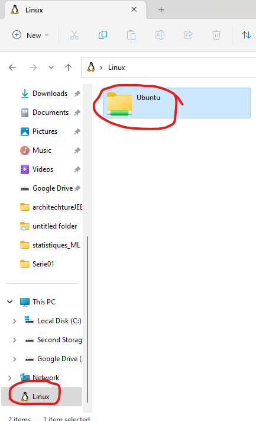
>
> Ici vous pouvez naviguer votre système de fichier normal
>
> 
>
> 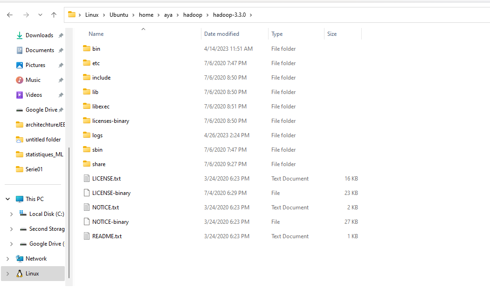
>

6. Comment utiliser les commandes hadoop?
> Au lieu de `hdfs` vous utilisez `$HADOOP_HOME/bin/hadoop fs`
>
> Exemple :
>
> Déplacer le fichier `myFile.txt` de votre machine vers le hdfs
> ```bash
> $HADOOP_HOME/bin/hadoop fs -put myfile.txt /input
> ``` 
> au lieu de
> ```bash
> hdfs dfs -put myfile.txt /input
> ```

7. Comment exécuter un programme java?
> My favorite question!
>
> Alors là c'est purement intellij.
>
>Allez dans `Run -> Edit Configurations`
>
> 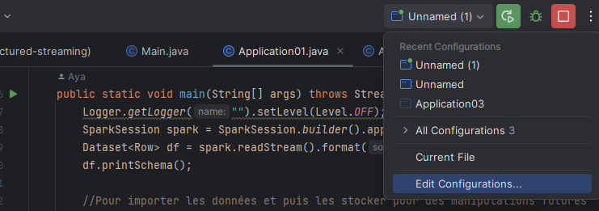
>
> Cliquez sur `+` et choisissez `Application`
>Puis dans Run on, choisissez `WSL`
>
> 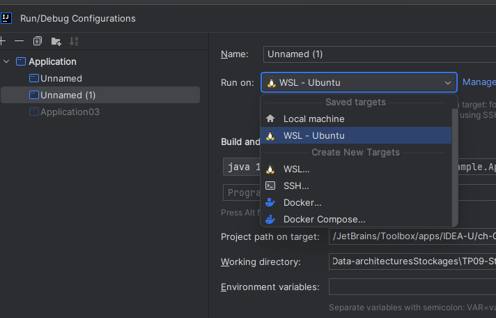
>
> Choisissez la classe que vous voulez exécuter
>
> 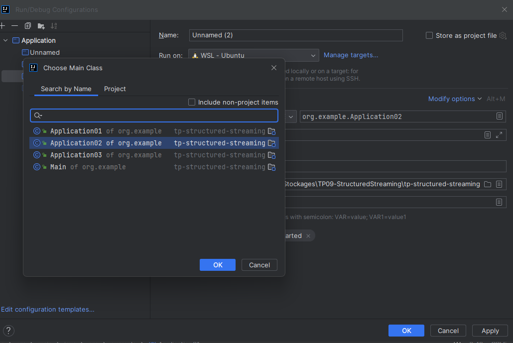
>
> Puis Apply et OK!
>
> Et voilà!
>
> 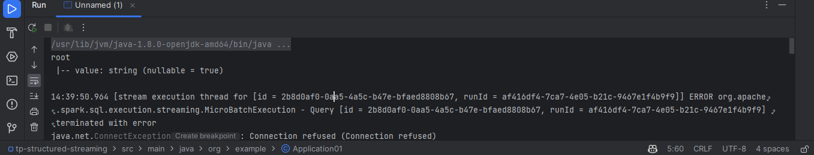
>
>
>
> D'aiileurs, vous pouvez aussi utiliser NetCat pour tester votre programme
>
>
> Ouvrez Ubuntu et saisissez la commande suivante :
>
> ```bash
> nc -lk 8080
> ```
>
>
> Et admirez le résultat dans intellij !


8. Comment utiliser spark?
> Bonne question... Même galère que pour hadoop.
>
> En tout cas, je ne vais pas traiter ce sujet dans ce tuto.
>
> Mais ça ne doit pas être très compliqué puisque maintenant vous savez comment utiliser WSL
>
> 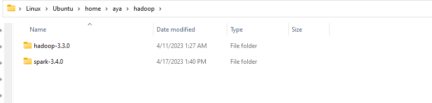

---

## Installation de jdk
1. Mettre à jour les packages
```bash
sudo apt update
```
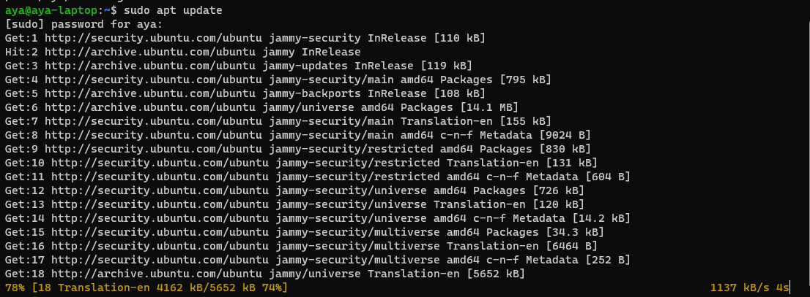

2. Installer jdk
```bash
sudo apt install openjdk-8-jdk
```
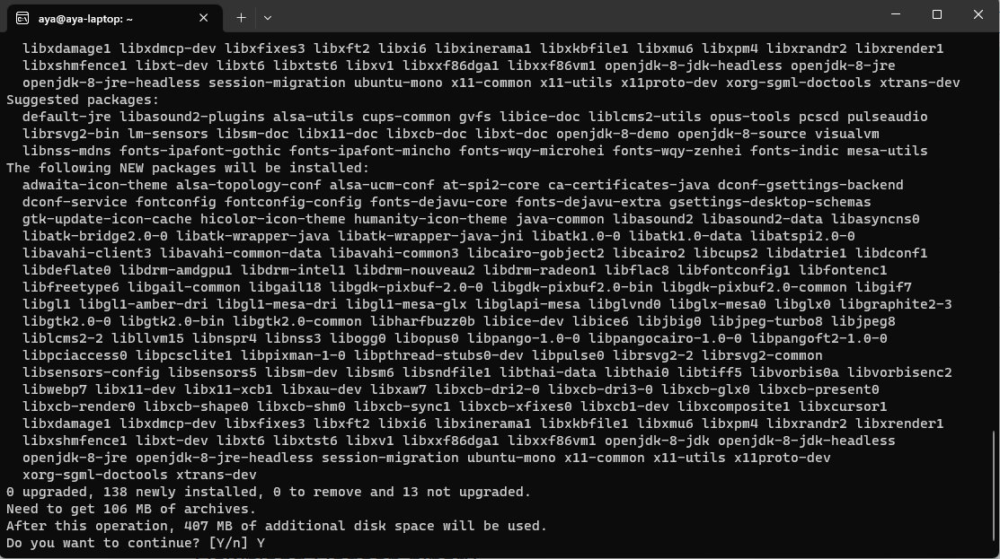

3. Vérifier l'installation
```bash
java -version
```
ça devrait afficher quelque chose comme ça


## Installation de hadoop
1. Télécharger hadoop
```bash
wget https://dlcdn.apache.org/hadoop/common/hadoop-3.3.2/hadoop-3.3.2.tar.gz
```

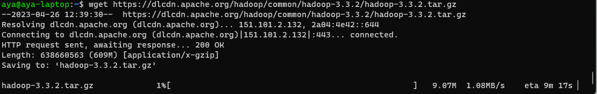

2. Créer un dossier hadoop dans le dossier personnel
```bash
mkdir ~/hadoop
```
Puis extraire le contenu de l'archive dans ce dossier
```bash
tar -xvzf hadoop-3.3.2.tar.gz -C ~/hadoop
```

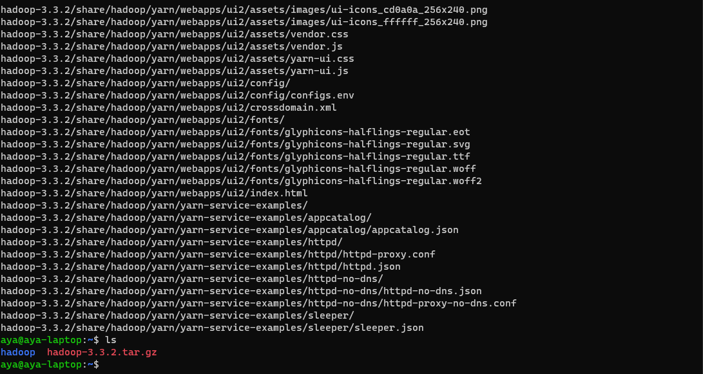

## Configuration ssh

1. Installer ssh
```bash
sudo apt install ssh
```

2. Générer une clé ssh
```bash
ssh-keygen -t rsa -P '' -f ~/.ssh/id_rsa
cat ~/.ssh/id_rsa.pub >> ~/.ssh/authorized_keys
chmod 0600 ~/.ssh/authorized_keys
```

3. Redémarrer le service ssh (facultatif)
```bash
sudo service ssh restart
```

4. Connexion en localhost
```bash
ssh localhost
```

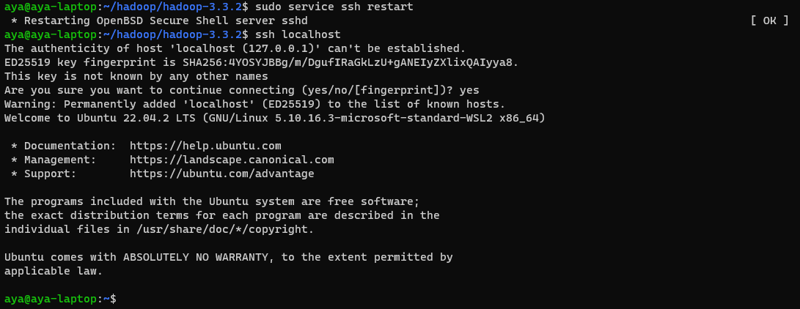


## Configuration hadoop

> **IMPORTANT** :
> Pour éditer les fichiers de configuration, j'utilise nano, mais vous pouvez utiliser n'importe quel éditeur de texte.
> 
> Pour sortir de nano, il faut appuyer sur `Ctrl + X` puis `Y` pour confirmer les changements et `Entrée` pour valider.
> 
> A chaque fois que je mentionne qu'il faut enregistrer les changements, il faut faire 
> - `Ctrl + X` 
> - puis `Y` 
> - puis `Entrée`.
> 

1. Modifier le fichier `~/.bashrc` en ajoutant les lignes suivantes à la fin du fichier
```bash
nano  ~/.bashrc
```
Puis ajouter les lignes suivantes à la fin du fichier
```bash
export JAVA_HOME=/usr/lib/jvm/java-1.8.0-openjdk-amd64
export HADOOP_HOME=~/hadoop/hadoop-3.3.2
export PATH=$PATH:$HADOOP_HOME/bin
export HADOOP_CONF_DIR=$HADOOP_HOME/etc/hadoop
```

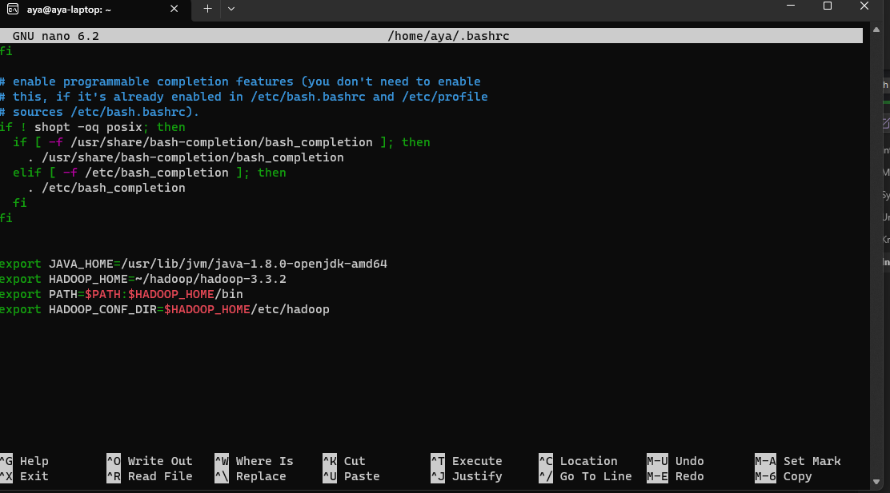

Enregistrer les changements (voir note importante)

2. Recharger le fichier `~/.bashrc`
```bash
source ~/.bashrc
```

3. Changer de répertoire vers le dossier de configuration de hadoop
```bash
cd ~/hadoop/hadoop-3.3.2
```
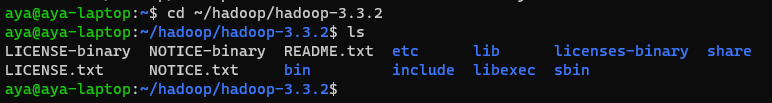

4. Modifier le fichier `etc/hadoop/hadoop-env.sh` en ajoutant la ligne suivante
```bash
nano etc/hadoop/hadoop-env.sh
```
Puis ajouter la ligne suivante
```bash
export JAVA_HOME=/usr/lib/jvm/java-1.8.0-openjdk-amd64
```
Ou bien modifier la ligne existante pour qu'elle ressemble à ça
```bash
JAVA_HOME=/usr/lib/jvm/java-1.8.0-openjdk-amd64
```

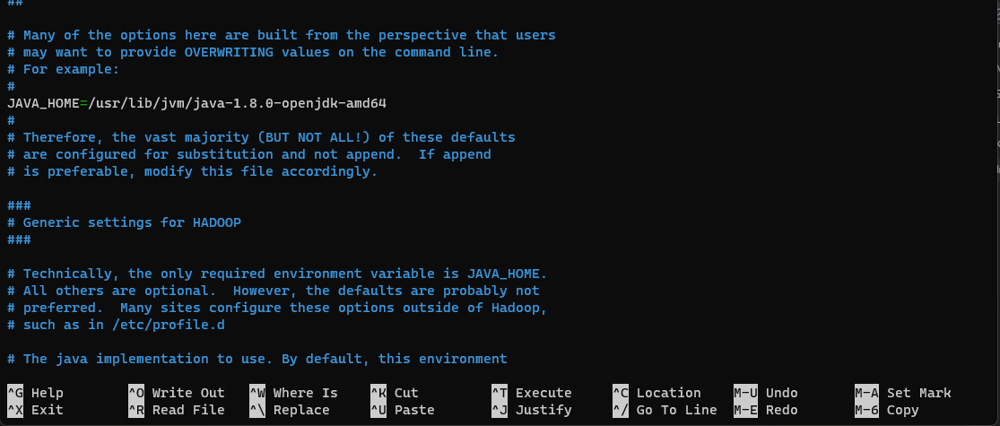

Enregistrer les changements (voir note importante)

5. Modifier le fichier `etc/hadoop/core-site.xml` en ajoutant les lignes suivantes
```bash
nano etc/hadoop/core-site.xml
```

```xml
<property>
         <name>fs.defaultFS</name>
         <value>hdfs://localhost:9000</value>
     </property>
```

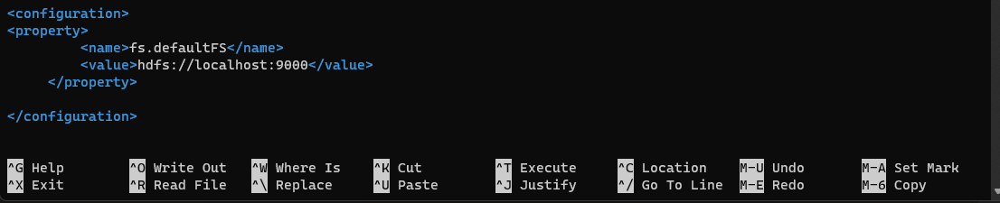

Enregistrer les changements (voir note importante)

6. Modifier le fichier `etc/hadoop/hdfs-site.xml` en ajoutant les lignes suivantes
```bash
nano etc/hadoop/hdfs-site.xml
```

```xml
<property>
         <name>dfs.replication</name>
         <value>1</value>
     </property>
     <property>
         <name>dfs.namenode.name.dir</name>
         <value>/home/aya/hadoop/dfs/nameDFS</value>
     </property>
     <property>
         <name>dfs.datanode.data.dir</name>
         <value>/home/aya/hadoop/dfs/dataDFS</value>
     </property>
```

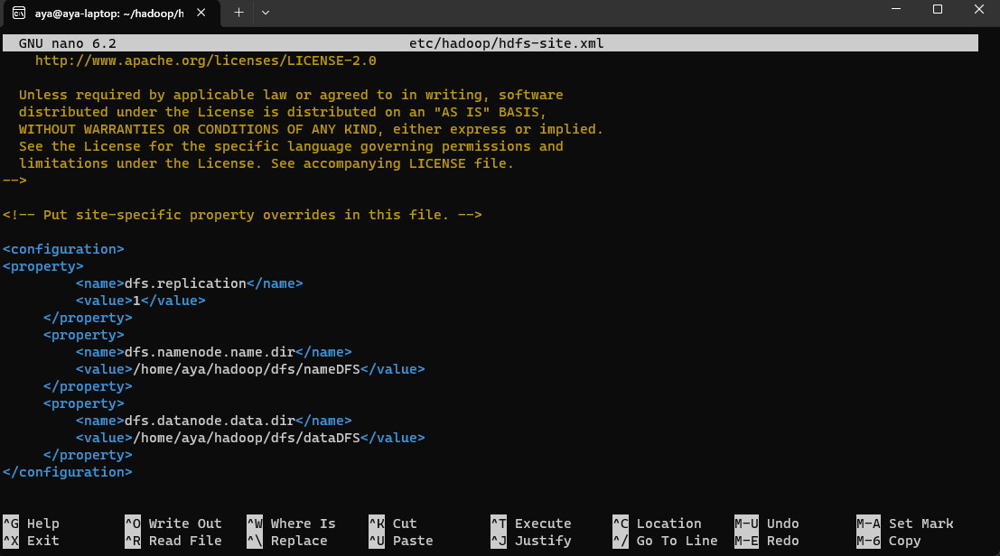

**Note** : 
- Il faut créer les dossiers `nameDFS` et `dataDFS` dans le dossier `hadoop/dfs`
- ```bash
  mkdir -p ~/hadoop/dfs/nameDFS
  mkdir -p ~/hadoop/dfs/dataDFS
  ```
- Il faut changer le chemin `/home/aya/hadoop/dfs` par le chemin absolu du dossier `hadoop/dfs` sur votre machine

Enregistrer les changements (voir note importante)

7. Modifier le fichier `etc/hadoop/mapred-site.xml` en ajoutant les lignes suivantes
```bash
nano etc/hadoop/mapred-site.xml
```

```xml
<property>
         <name>mapreduce.framework.name</name>
         <value>yarn</value>
     </property>
     <property>
         <name>mapreduce.application.classpath</name>
         <value>$HADOOP_MAPRED_HOME/share/hadoop/mapreduce/*:$HADOOP_MAPRED_HOME/share/hadoop/mapreduce/lib *</value>
     </property>
```

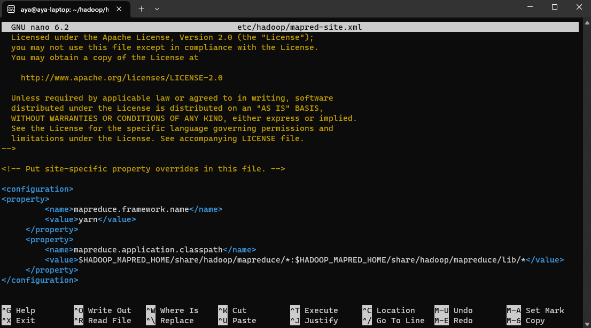

Enregistrer les changements (voir note importante)

8. Modifier le fichier `etc/hadoop/yarn-site.xml` 
```bash
nano etc/hadoop/yarn-site.xml
```
en ajoutant les lignes suivantes
```xml
<property>
        <name>yarn.nodemanager.aux-services</name>
        <value>mapreduce_shuffle</value>
    </property>
    <property>
        <name>yarn.nodemanager.env-whitelist</name>
        <value>JAVA_HOME,HADOOP_COMMON_HOME,HADOOP_HDFS_HOME,HADOOP_CONF_DIR,CLASSPATH_PREPEND_DISTCACHE,HADOOP_YARN_HOME,HADOOP_MAPRED_HOME</value>
    </property>
```

Enregistrer les changements (voir note importante)


## Démarrer hadoop
Si vous avez suivi toutes les étapes précédentes, vous pouvez maintenant démarrer hadoop

1. Formater le namenode
```bash
bin/hdfs namenode -format -force
```

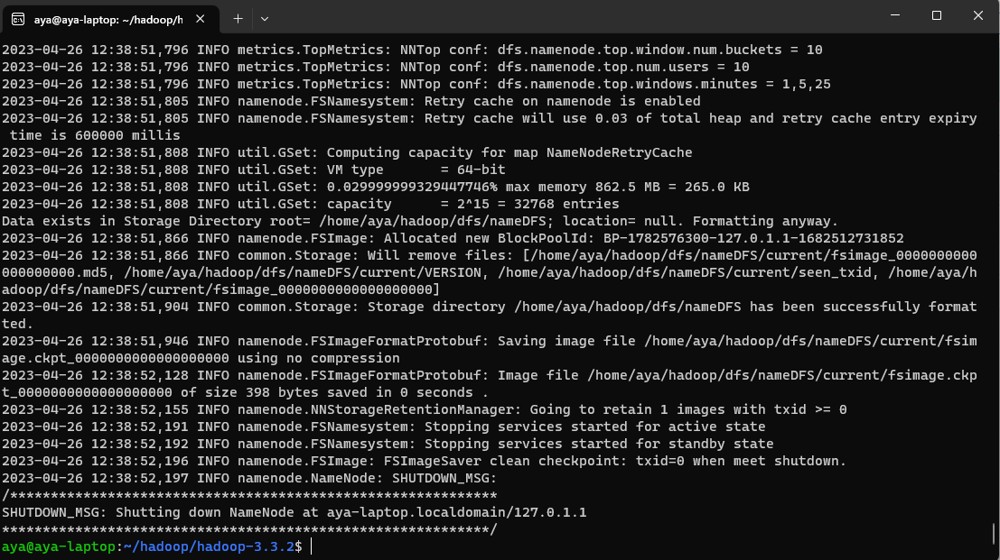

2. Démarrer hdfds
```bash
sbin/start-dfs.sh
```
Pour vérifier, accéder au lien http://localhost:9870/dfshealth.html#tab-overview
Ça doit afficher ceci :

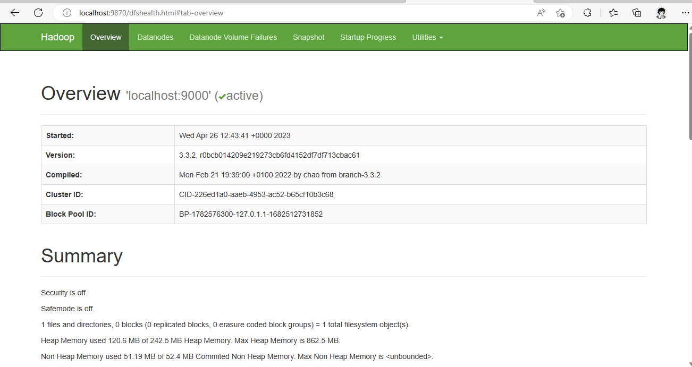


3. Démarrer yarn
```bash
sbin/start-yarn.sh
```

Si tout marche bien vous accéder au lien 
http://localhost:8088/cluster

Ça doit afficher ceci :

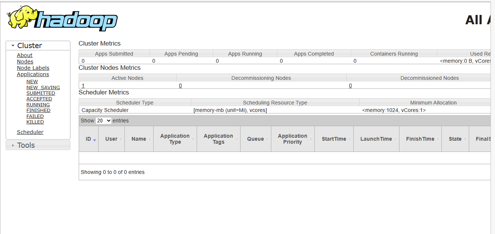

Assurez-vous que les services suivannts marchent bien :

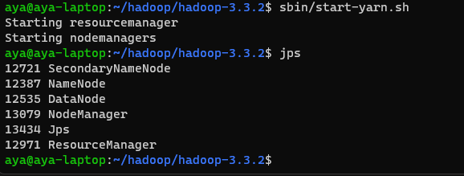


4. Arrêter hadoop
```bash
sbin/stop-dfs.sh
sbin/stop-yarn.sh
```

---

## Les commandes de chaque jour

Maintenant que vous avez installé hadoop, à chaque fois que vous voulez l'utiliser, vous devez suivre les étapes suivantes :

1. Ouvrir ubuntu
2. Redémarrer ssh
```bash
sudo service ssh restart 
```
(Si vous obtenez sshd: no hostkeys available -- exiting. Ce n'est pas un problème, continuez)

3. Accéder au localhost
```bash
ssh localhost
```
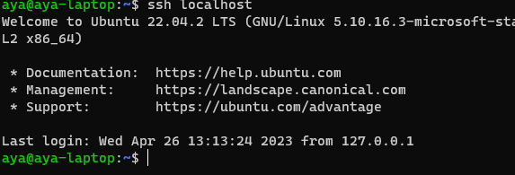

4. Supprimer les fichiers temporaires
```bash
 sudo rm -R /tmp/*
```

5. Démarrer hadoop
```bash
$HADOOP_HOME/bin/hdfs namenode -format -force
$HADOOP_HOME/sbin/start-dfs.sh
$HADOOP_HOME/sbin/start-yarn.sh
```

S'assurer que tout marche bien :
```bash
jps
```
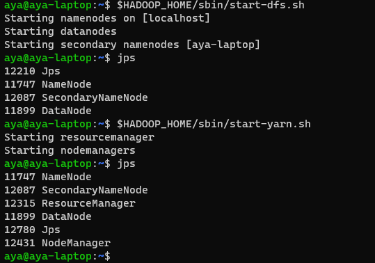

6. Arrêter hadoop
```bash
$HADOOP_HOME/sbin/stop-dfs.sh
$HADOOP_HOME/sbin/stop-yarn.sh
```

7. Quitter ssh
```bash
exit
```

---


