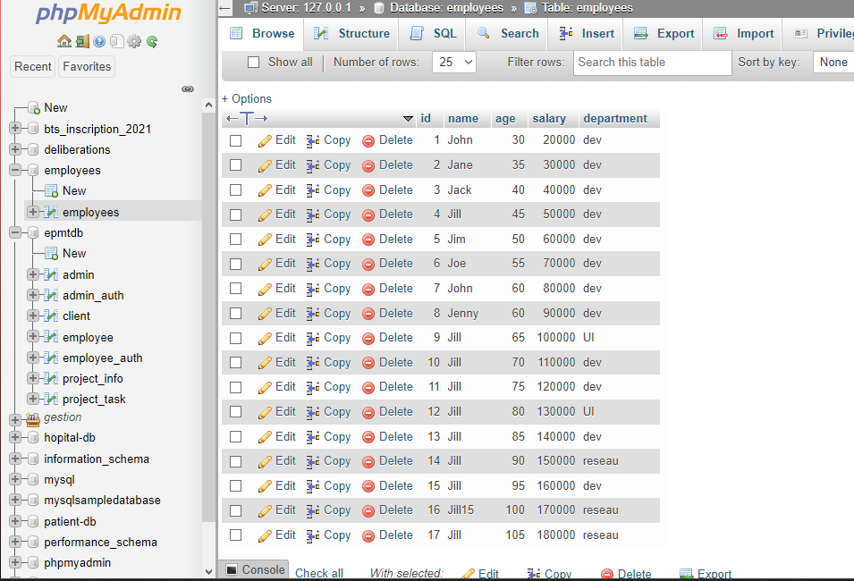

# SPARK SQL

## 1.Fichier Json
* Dataframe est un dataset de type Row
* Dataset est un dataframe avec des types de données

### 1.1 Configuration
Pour utiliser Spark SQL, il faut ajouter les dépendances suivantes dans le fichier `pom.xml`
```xml
<dependency>
    <groupId>org.apache.spark</groupId>
    <artifactId>spark-sql_2.12</artifactId>
    <version>3.0.1</version>
</dependency>
```
Pour ne pas afficher trop de logs, on peut ajouter la ligne suivante dans le fichier `log4j.properties`
```java
Logger.getLogger("org").setLevel(Level.OFF);
```
### 1.2 Lecture d'un fichier Json
Nous allons traiter le fichier JSon suivant :
````json
[
  {"id": 1, "name": "John", "age": 25,"salary": 20000, "department": "dev"},
  {"id": 2, "name": "Jane", "age": 30,"salary": 30000, "department": "dev"},
  {"id": 3, "name": "Jack", "age": 35,"salary": 40000, "department": "dev"},
  {"id": 4, "name": "Jill", "age": 40,"salary": 50000, "department": "dev"},
  {"id": 5, "name": "Joe", "age": 45,"salary": 60000, "department": "dev"},
  {"id": 6, "name": "Jen", "age": 50,"salary": 70000, "department": "dev"},
  {"id": 7, "name": "Jim", "age": 55,"salary": 80000, "department": "dev"},
  {"id": 8, "name": "Jenny", "age": 60,"salary": 90000, "department": "dev"},
  {"id": 9, "name": "Jill", "age": 65,"salary": 100000, "department": "UI"},
  {"id": 10, "name": "Jill", "age": 70,"salary": 110000, "department": "dev"},
  {"id": 11, "name": "Jill", "age": 75,"salary": 120000, "department": "dev"},
  {"id": 12, "name": "Jill", "age": 80,"salary": 130000, "department": "UI"},
  {"id": 13, "name": "Jill", "age": 85,"salary": 140000, "department": "dev"},
  {"id": 14, "name": "Jill", "age": 90,"salary": 150000, "department": "reseau"},
  {"id": 15, "name": "Jill", "age": 95,"salary": 160000, "department": "dev"},
  {"id": 16, "name": "Jill15", "age": 100,"salary": 170000, "department": "reseau"},
  {"id": 17, "name": "Jill", "age": 105,"salary": 180000, "departement" : "reseau"

]
````
Il seta situé à `src/main/resources/employees.json` .

On initialise un SparkSession
```java
 SparkSession sparkSession = SparkSession.builder().master("local[*]").appName("SparkByExamples.com").getOrCreate();
```
On lit le fichier Json
```java
Dataset<Row> dfEmpl = sparkSession.read().option("multiline",true).json("src/main/resources/employees.json");
```
On affiche le schema
```java
dfEmpl.printSchema();
```
Ce qui donne
```bash
root
 |-- age: long (nullable = true)
 |-- departement: string (nullable = true)
 |-- department: string (nullable = true)
 |-- id: long (nullable = true)
 |-- name: string (nullable = true)
 |-- salary: long (nullable = true)
```

On affiche les données
```java
dfEmpl.show();
```

Si on vent préciser les colonnes à afficher
```java
dfEmpl.select("name","salary").show();
```
Ce qui donne
```bash
+-----+------+
| name|salary|
+-----+------+
| John| 20000|
| Jane| 30000|
| Jack| 40000|
...
```

Pour effectuer des traitements sur les colonnes, on importe les fonctions.
Cette librairie permet de charger les opérations à exécuter sur chaque colonne

```java
import static org.apache.spark.sql.functions.col;
import static org.apache.spark.sql.functions.expr;
```

Maintenant on peut utiliser des filtres sur les colonnes
```java
 dfEmpl.filter(col("salary").gt(25000).and(col("name").startsWith("J"))).show();
```
C'est équivalant à la requête SQL suivante
```sql
SELECT * FROM dfEmpl WHERE salary > 25000 AND name LIKE 'J%'
```
Ce qui donne
```bash
+---+-----+---+------+----------+
| id| name|age|salary|department|
+---+-----+---+------+----------+
|  9| Jill| 65|100000|        UI|
| 10| Jill| 70|110000|       dev|
| 11| Jill| 75|120000|       dev|
| 12| Jill| 80|130000|        UI|
| 13| Jill| 85|140000|       dev|
| 14| Jill| 90|150000|    reseau|
| 15| Jill| 95|160000|       dev|
| 16|Jill15|100|170000|    reseau|
+---+-----+---+------+----------+
```

On peut aussi utiliser des expressions
```java
dfEmpl.filter("salary > 25000 and name like 'J%'").show();
```

On peut toujours créer des tables (vues) temporaires, pour pouvoir les utiliser dans des requêtes SQL.
Les tables temporaires permettent de faire des requêtes SQL sur des Dataframes pour lesquels on n'a pas de schéma.
```java
dfEmpl.createOrReplaceTempView("EMPLOYEES");
```
On peut ensuite faire des requêtes SQL
```java
sparkSession.sql("SELECT * FROM EMPLOYEES WHERE salary > 25000 AND name LIKE 'J%'").show();
```
Ce qui donne
```bash
+---+-----+---+------+----------+
| id| name|age|salary|department|
+---+-----+---+------+----------+
|  9| Jill| 65|100000|        UI|
| 10| Jill| 70|110000|       dev|
...
```

### 1.3 Application 
* Afficher le salaire moyen par département
* Afficher le salaire min et max par département

#### Solution
> Afficher le salaire moyen par département
```java
// Avec SQL
sparkSession.sql("select department, avg(salary) as avg_salary from employees group by department").show();
// Avec DataFrame
 dfEmpl.groupBy("department").avg("salary").show();
```
> Afficher le salaire min et max par département
```java
// Avec sql
sparkSession.sql("select department, min(salary) as min_salary, max(salary) as max_salary from employees group by department").show();
// Avec dataframe
dfEmpl.groupBy("department").min("salary").show();
dfEmpl.groupBy("department").max("salary").show();
```

## 2. Fichier CSV

On crée un fichier CSV, similaire au fichier Json
```csv
id,name,age,salary,department
1,John,30,20000.0,dev
2,Jane,35,30000,dev
3,Jack,40,40000,dev
4,Jill,45,50000,dev
5,Jim,50,60000,dev
6,Joe,55,70000,dev
7,John,60,80000,dev
8,Jenny,60,90000,dev
9,Jill,65,100000,UI
10,Jill,70,110000,dev
11,Jill,75,120000,dev
12,Jill,80,130000,UI
13,Jill,85,140000,dev
14,Jill,90,150000,reseau
15,Jill,95,160000,dev
16,Jill15,100,170000,reseau
17,Jill,105,180000,reseau
```
Il se trouve à `src/main/resources/employees.csv` .

### 2.1 Lecture du fichier CSV
On lit le fichier CSV
```java
Dataset<Row> dfEmpl = sparkSession.read().option("header",true).csv("src/main/resources/employees.csv");
```
La méthode `option` permet de passer des options au lecteur de fichier.
Ici on passe l'option `header` à `true` pour dire que le fichier CSV contient une ligne d'entête.

On affiche le schema
```java
dfEmpl.printSchema();
```
Ce qui donne
```bash
root
 |-- id: string (nullable = true)
 |-- name: string (nullable = true)
 |-- age: string (nullable = true)
 |-- salary: string (nullable = true)
 |-- department: string (nullable = true)
```
On remarque que les colonnes `id`, `age` et `salary` sont de type `string` alors qu'on s'attend à avoir des entiers.
C'est parce que le fichier CSV n'a pas de schéma, et que Spark ne peut pas déterminer le type des colonnes.

On peut forcer le type des colonnes en utilisant la méthode `schema`
```java
dfEmpl = sparkSession.read().option("header",true).option("inferSchema",true).csv("src/main/resources/employees.csv");
```
Cette option `inferSchema` permet de forcer Spark à déterminer le type des colonnes.

On remarque que le type des colonnes a changé.
```bash
root
    |-- id: integer (nullable = true)
    |-- name: string (nullable = true)
    |-- age: integer (nullable = true)
    |-- salary: double (nullable = true)
    |-- department: string (nullable = true)
```

Les manipulations sur les Dataframes sont les mêmes que pour les fichiers Json.

## 3. Communiquez avec une base de données
On a besoin d'installer XAMPP pour avoir une base de données MySQL.
On peut télécharger XAMPP à l'adresse suivante : https://www.apachefriends.org/fr/index.html

On lance XAMPP et on démarre le serveur Apache et MySQL.

### 3.1 Création de la base de données
On se connecte à la base de données MySQL avec l'outil `phpMyAdmin` à l'adresse suivante : http://localhost/phpmyadmin/
```sql
CREATE DATABASE employees;
```
On crée une table `employees` dans la base de données `employees`
```sql
CREATE TABLE employees (
    id INT NOT NULL AUTO_INCREMENT,
    name VARCHAR(50) NOT NULL,
    age INT NOT NULL,
    salary DOUBLE NOT NULL,
    department VARCHAR(50) NOT NULL,
    PRIMARY KEY (id)
);
```
On insère des données dans la table `employees`
```sql
INSERT INTO employees (name, age, salary, department) VALUES
    ('John', 30, 20000, 'dev'),
    ('Jane', 35, 30000, 'dev'),
    ('Jack', 40, 40000, 'dev'),
    ('Jill', 45, 50000, 'dev'),
    ('Jim', 50, 60000, 'dev'),
    ('Joe', 55, 70000, 'dev'),
    ('John', 60, 80000, 'dev'),
    ('Jenny', 60, 90000, 'dev'),
    ('Jill', 65, 100000, 'UI'),
    ('Jill', 70, 110000, 'dev'),
    ('Jill', 75, 120000, 'dev'),
    ('Jill', 80, 130000, 'UI'),
    ('Jill', 85, 140000, 'dev'),
    ('Jill', 90, 150000, 'reseau'),
    ('Jill', 95, 160000, 'dev'),
    ('Jill15', 100, 170000, 'reseau'),
    ('Jill', 105, 180000, 'reseau');
```
Voici le résultat



### 3.2 Configuration du projet
Pour pouvoir communiquer avec une base de données, on doit ajouter les dépendances suivantes dans le fichier `pom.xml`
```xml
<dependency>
    <groupId>mysql</groupId>
    <artifactId>mysql-connector-java</artifactId>
    <version>8.0.23</version>
</dependency>
```

On importe les dépendances dans le fichier `Main.java`
```java
import com.mysql.cj.jdbc.Driver;
```

### 3.3 Lecture de la base de données
On lit la table `employees` de la base de données `employees`
```java
Dataset<Row> dfEmpl = sparkSession.read().format("jdbc")
        .option("url", "jdbc:mysql://localhost:3306/employees")
        .option("driver", "com.mysql.cj.jdbc.Driver")
        .option("dbtable", "employees")
        .option("user", "root")
        .option("password", "")
        .load();
```

Une autre possibilité est de créer un Map contenant les options
```java
import java.util.HashMap;
import java.util.Map;

{...}
        
Map<String, String> options = new HashMap<>();
options.put("url", "jdbc:mysql://localhost:3306/employees");
options.put("driver", "com.mysql.cj.jdbc.Driver");
options.put("user", "root");
options.put("password", "");

Dataset<Row> dfEmpl = sparkSession.read().format("jdbc").options(options).option("dbtable", "employees").load();
```
> **ATTENTION** : Quand on veut insérer un Map contenant les options on utilise la méthode `options` et non `option`.

On affiche le schema
```java
dfEmpl.printSchema();
```
Ce qui donne
```bash
root
 |-- id: integer (nullable = true)
 |-- name: string (nullable = true)
 |-- age: integer (nullable = true)
 |-- salary: double (nullable = true)
 |-- department: string (nullable = true)
```
> Si on veut importer plusieurs tables, on peut utiliser la requête `SELECT * FROM employees, departments` dans la méthode `option("dbtable", "employees")`
> ```java
>.option("dbtable", "SELECT * FROM employees, departments")
> ```
## 4. Datasets

> Les datasets
> Dans Spark, les Dataframes sont des datasets de type Row.
> On peut donc utiliser les méthodes des datasets sur les Dataframes.
> Par exemple, on peut utiliser la méthode `map` pour transformer les données d'un Dataframe en un autre Dataframe.
> 
> Datasets sont similaires aux RDDs, mais avec des avantages supplémentaires.
> Ils utilisent un encodeur pour convertir les objets en enregistrements binaires.

Nous allons créer un dataset à partir du Dataframe `dfEmpl`

### 4.1 Création d'un dataset
On crée une classe `Employee`
```java
@NoArgsConstructor
@AllArgsConstructor
public class Employee implements Serializable {
    private int id;
    private String name;

    private int age;
    private String dept;
    private double salary;

}
```
On crée un dataset à partir du Dataframe `dfEmpl`
```java
import org.apache.spark.sql.Encoders;
    
    {...}
            
Encoder<Employee> employeeEncoder = Encoders.bean(Employee.class);
Dataset<Employee> dsEmpl = sparkSession.read().json("src/main/resources/employees.json").as(employeeEncoder);
```
On affiche le schema du dataset
```java
dsEmpl.printSchema();
```
Ce qui donne
```bash
root
 |-- id: integer (nullable = true)
 |-- name: string (nullable = true)
 |-- age: integer (nullable = true)
 |-- salary: double (nullable = true)
 |-- department: string (nullable = true)
```

On affiche les données du dataset
```java 
dsEmpl.show();
```
Ce qui donne
```bash
+---+-----+---+------+----------+
| id| name|age|salary|department|
+---+-----+---+------+----------+
|  1| John| 30|20000.0|       dev|
|  2| Jane| 35|30000.0|       dev|
|  3| Jack| 40|40000.0|       dev|
...
```

On test Filtre
```java
dsEmpl.filter((FilterFunction<Employee>) employee -> employee.getSalary() > 25000 && employee.getName().startsWith("J")).show();
```
La méthode `filter` prend en paramètre une fonction qui prend en paramètre un objet de type `Employee` et retourne un booléen.

`FilterFunction` est une interface fonctionnelle qui prend en paramètre un objet de type `Employee` et retourne un booléen.
Elle permet de simplifier l'écriture de la fonction.

On exécute la requête
```bash
+---+-----+---+------+----------+
| id| name|age|salary|department|
+---+-----+---+------+----------+
|  2| Jane| 35|30000.0|       dev|
|  3| Jack| 40|40000.0|       dev|
...
```

### 4.2. Conversion d'un Dataframe en Dataset
On crée un Dataframe à partir du Dataset `dsEmpl`
```java
Dataset<Row> dfEmpl2 = dsEmpl.toDF();
```

On affiche le schema du Dataframe
```java
dfEmpl2.printSchema();
```
Ce qui donne
```bash
root
 |-- id: integer (nullable = true)
 |-- name: string (nullable = true)
 |-- age: integer (nullable = true)
 |-- salary: double (nullable = true)
 |-- department: string (nullable = true)
```

- Dataframe vers dataset
```java
Dataset<Employee> dsEmpl = dfEmpl.as(employeeEncoder);
dsEmpl.show();
```
- Dataset vers RDD
```java
JavaRDD<Employee> rddEmpl = dsEmpl.as(Encoders.bean(Employee.class)).toJavaRDD();
rddEmpl.foreach(employee -> System.out.println(employee.getName()));
```
- RDD vers Dataset
```java
//Convert javaRDD to RDD
Dataset<Employee> dsEmpl2 = sparkSession.createDataset(rddEmpl.rdd(), employeeEncoder);
dsEmpl2.show();
```
- Dataset vers Dataframe
```java
Dataset<Row> dfEmpl2 = dsEmpl.toDF();
dfEmpl2.show();
```
- Dataframe vers RDD
```java
JavaRDD<Employee> rddEmpl2 = dfEmpl.as(employeeEncoder).javaRDD();
rddEmpl2.foreach(employee -> System.out.println(employee.getName()));
```
- RDD vers Dataframe
```java
Dataset<Row> dfEmpl2 = sparkSession.createDataFrame(rddEmpl, Employee.class);
dfEmpl2.show();
```
