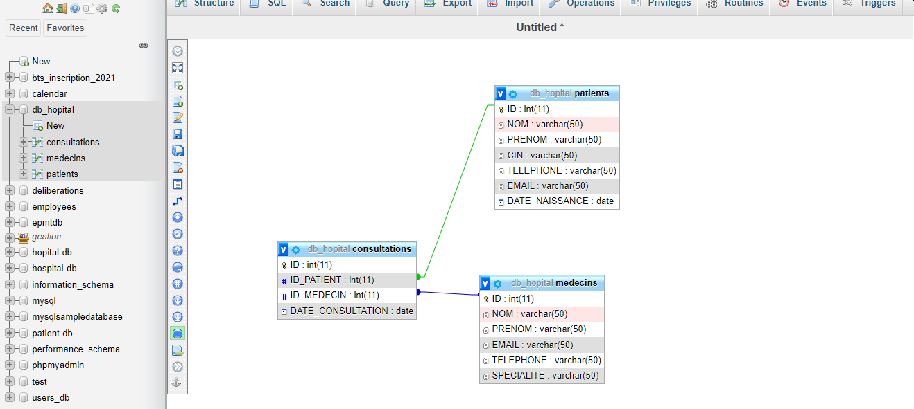
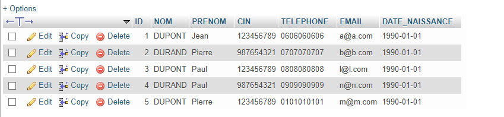
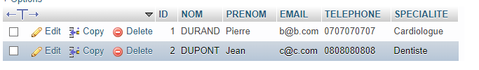
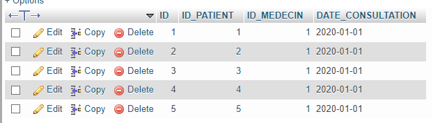
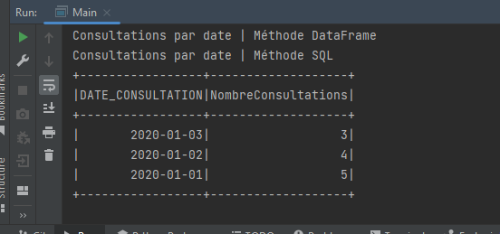
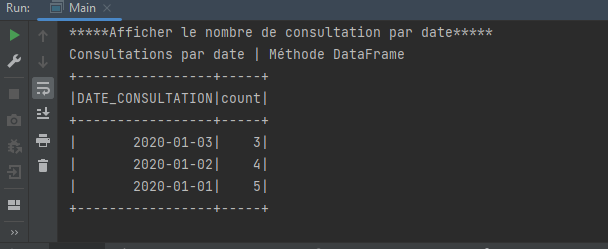
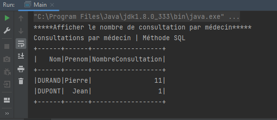
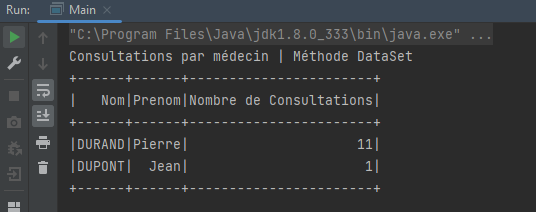
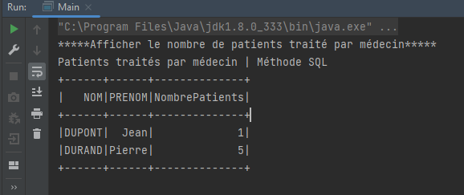
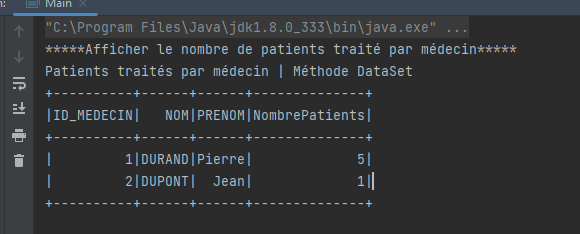

# Traitement de données stockées dans Mysql

## Création de la base de données

Notre base de données est appélé `DB_HOPITAL`. Elle est composée de 3 table :
* PATIENTS : contient les informations des patients
  * ID : identifiant unique du patient (clé primaire) (int 11)
  * NOM : nom du patient (varchar 50)
  * PRENOM : prénom du patient (varchar 50)
  * CIN : numéro de la carte d'identité nationale (varchar 50)
  * TELEPHONE : numéro de téléphone du patient (varchar 50)
  * EMAIL : adresse email du patient (varchar 50)
  * DATE_NAISSANCE : date de naissance du patient (date)
* MEDECINS : contient les informations des médecins
  * ID : identifiant unique du médecin (clé primaire) (int 11)
  * NOM : nom du médecin (varchar 50)
  * PRENOM : prénom du médecin (varchar 50)
  * EMAIL : adresse email du médecin (varchar 50)
  * TELEPHONE : numéro de téléphone du médecin (varchar 50)
  * SPECIALITE : spécialité du médecin (varchar 50)
* CONSULTATIONS : contient les informations des consultations
  * ID : identifiant unique de la consultation (clé primaire) (int 11)
  * ID_PATIENT : identifiant du patient (clé étrangère) (int 11)
  * ID_MEDECIN : identifiant du médecin (clé étrangère) (int 11)
  * DATE_CONSULTATION : date de la consultation (date)


### Création de la base de données

Nous allons lancé XAMPP pour créer notre base de données. Nous allons ensuite ouvrir notre navigateur et taper l'adresse suivante : `http://localhost/phpmyadmin/`. Nous allons ensuite saisir la requête suivante :

```sql
CREATE DATABASE DB_HOPITAL;
```

### Création des tables
Afin de créer les tables, nous allons saisir les requêtes suivantes :

```sql
CREATE TABLE PATIENTS (
  ID INT(11) NOT NULL AUTO_INCREMENT,
  NOM VARCHAR(50) NOT NULL,
  PRENOM VARCHAR(50) NOT NULL,
  CIN VARCHAR(50) NOT NULL,
  TELEPHONE VARCHAR(50) NOT NULL,
  EMAIL VARCHAR(50) NOT NULL,
  DATE_NAISSANCE DATE NOT NULL,
  PRIMARY KEY (ID)
);
```

```sql
CREATE TABLE MEDECINS (
  ID INT(11) NOT NULL AUTO_INCREMENT,
  NOM VARCHAR(50) NOT NULL,
  PRENOM VARCHAR(50) NOT NULL,
  EMAIL VARCHAR(50) NOT NULL,
  TELEPHONE VARCHAR(50) NOT NULL,
  SPECIALITE VARCHAR(50) NOT NULL,
  PRIMARY KEY (ID)
);
```

```sql
CREATE TABLE CONSULTATIONS (
  ID INT(11) NOT NULL AUTO_INCREMENT,
  ID_PATIENT INT(11) NOT NULL,
  ID_MEDECIN INT(11) NOT NULL,
  DATE_CONSULTATION DATE NOT NULL,
  PRIMARY KEY (ID),
  FOREIGN KEY (ID_PATIENT) REFERENCES PATIENTS(ID),
  FOREIGN KEY (ID_MEDECIN) REFERENCES MEDECINS(ID)
);
```

## Insertion des données

Pour les tests, nous allons insérer des données dans nos tables. Nous allons saisir les requêtes suivantes :

```sql
INSERT INTO PATIENTS (NOM, PRENOM, CIN, TELEPHONE, EMAIL, DATE_NAISSANCE) VALUES ('DUPONT', 'Jean', '123456789', '0606060606', 'a@a.com', '1990-01-01');

INSERT INTO PATIENTS (NOM, PRENOM, CIN, TELEPHONE, EMAIL, DATE_NAISSANCE) VALUES ('DURAND', 'Pierre', '987654321', '0707070707', 'b@b.com', '1990-01-01');

INSERT INTO PATIENTS (NOM, PRENOM, CIN, TELEPHONE, EMAIL, DATE_NAISSANCE) VALUES ('DUPONT', 'Paul', '123456789', '0808080808', 'l@l.com', '1990-01-01');

INSERT INTO PATIENTS (NOM, PRENOM, CIN, TELEPHONE, EMAIL, DATE_NAISSANCE) VALUES ('DURAND', 'Paul', '987654321', '0909090909', 'n@n.com', '1990-01-01');

INSERT INTO PATIENTS (NOM, PRENOM, CIN, TELEPHONE, EMAIL, DATE_NAISSANCE) VALUES ('DUPONT', 'Pierre', '123456789', '0101010101', 'm@m.com', '1990-01-01');
```

```sql
INSERT INTO MEDECINS (NOM, PRENOM, EMAIL, TELEPHONE, SPECIALITE) VALUES ('DURAND', 'Pierre', 'b@b.com', '0707070707', 'Cardiologue');

INSERT INTO MEDECINS (NOM, PRENOM, EMAIL, TELEPHONE, SPECIALITE) VALUES ('DUPONT', 'Jean', 'c@c.com', '0808080808', 'Dentiste');
```

```sql
INSERT INTO CONSULTATIONS (ID_PATIENT, ID_MEDECIN, DATE_CONSULTATION) VALUES (1, 1, '2020-01-01');

INSERT INTO CONSULTATIONS (ID_PATIENT, ID_MEDECIN, DATE_CONSULTATION) VALUES (2, 1, '2020-01-01');

INSERT INTO CONSULTATIONS (ID_PATIENT, ID_MEDECIN, DATE_CONSULTATION) VALUES (3, 1, '2020-01-01');

INSERT INTO CONSULTATIONS (ID_PATIENT, ID_MEDECIN, DATE_CONSULTATION) VALUES (4, 1, '2020-01-01');

INSERT INTO CONSULTATIONS (ID_PATIENT, ID_MEDECIN, DATE_CONSULTATION) VALUES (5, 1, '2020-01-01');
```

Voici le résultat de nos requêtes :



 





## Initialisation du projet Java et des dépendances

Nous allons maintenant créer notre projet Java. Nous allons créer un projet Maven. Nous allons ensuite ajouter les dépendances suivantes :

```xml
<!-- https://mvnrepository.com/artifact/org.apache.spark/spark-core -->
<dependency>
  <groupId>org.apache.spark</groupId>
  <artifactId>spark-core_2.13</artifactId>
  <version>3.3.2</version>
</dependency>

        <!-- https://mvnrepository.com/artifact/org.apache.spark/spark-sql -->
<dependency>
<groupId>org.apache.spark</groupId>
<artifactId>spark-sql_2.13</artifactId>
<version>3.3.2</version>
</dependency>
        <!-- https://mvnrepository.com/artifact/mysql/mysql-connector-java -->
<dependency>
<groupId>mysql</groupId>
<artifactId>mysql-connector-java</artifactId>
<version>8.0.32</version>
</dependency>
        <!--Lombok-->
<dependency>
<groupId>org.projectlombok</groupId>
<artifactId>lombok</artifactId>
<version>1.18.22</version>
</dependency>
```

Pour ceci nous allons ajouter d'avantage de données dans notre table CONSULTATIONS. Nous allons saisir les requêtes suivantes :

```sql
INSERT INTO CONSULTATIONS (ID_PATIENT, ID_MEDECIN, DATE_CONSULTATION) VALUES (1, 1, '2020-01-02');

INSERT INTO CONSULTATIONS (ID_PATIENT, ID_MEDECIN, DATE_CONSULTATION) VALUES (2, 1, '2020-01-02');

INSERT INTO CONSULTATIONS (ID_PATIENT, ID_MEDECIN, DATE_CONSULTATION) VALUES (3, 1, '2020-01-02');

INSERT INTO CONSULTATIONS (ID_PATIENT, ID_MEDECIN, DATE_CONSULTATION) VALUES (4, 1, '2020-01-02');
```

```sql
INSERT INTO CONSULTATIONS (ID_PATIENT, ID_MEDECIN, DATE_CONSULTATION) VALUES (1, 1, '2020-01-03');

INSERT INTO CONSULTATIONS (ID_PATIENT, ID_MEDECIN, DATE_CONSULTATION) VALUES (2, 1, '2020-01-03');

INSERT INTO CONSULTATIONS (ID_PATIENT, ID_MEDECIN, DATE_CONSULTATION) VALUES (3, 1, '2020-01-03');
```

On cherche à afficher le nombre de consultation par jours. 

Pour chacune des questions, nous allons la résoudre de 2 manières :
- Méthode SQL : nous allons utiliser une requête SQL 
- Méthode DataFrame : nous allons utiliser les méthodes de Spark SQL


## 1. Afficher le nombre de consultation par jours 
### Méthode SQL

Nous allons utiliser la requête suivante :

```sql
SELECT DATE_CONSULTATION, COUNT(*) AS NombreConsultations FROM consultations GROUP BY DATE_CONSULTATION;
```


Dans la classe `Main`, nous allons initier une SparkSession. Nous allons ensuite créer un DataFrame à partir de la table `consultations`. 

```java
public static void main(String[] args) {
        Logger.getLogger("").setLevel(Level.OFF);
        
        
        SparkSession sparkSession = SparkSession.builder().master("local[*]").appName("SparkByExamples.com").getOrCreate();
        Dataset<Row> df = sparkSession.read().format("jdbc")
        .option("driver", "com.mysql.cj.jdbc.Driver")
        .option("url", "jdbc:mysql://localhost:3306/DB_HOPITAL")
        .option("user", "root")
        .option("password","")
        .option("dbtable","CONSULTATIONS")
        .load();
        df.createOrReplaceTempView("consultationsParDate");
        
        
        System.out.println("*****Afficher le nombre de consultation par date*****");
        System.out.println("Consultations par date | Méthode SQL");
        Dataset<Row> dfConsultationsParDate = sparkSession
                .sql("SELECT DATE_CONSULTATION, COUNT(*) AS NombreConsultations FROM consultationsParDate GROUP BY DATE_CONSULTATION");
        dfConsultationsParDate.show();
    }
```
Note : Nous avons créé une vue temporaire `consultationsParDate` à partir de la table `consultations`.

On obtient le résultat suivant :

```bash
*****Afficher le nombre de consultation par date*****
Consultations par date | Méthode SQL
+-----------------+-------------------+
|DATE_CONSULTATION|NombreConsultations|
+-----------------+-------------------+
|       2020-01-03|                  3|
|       2020-01-02|                  4|
|       2020-01-01|                  5|
+-----------------+-------------------+
```




### Méthode DataFrame

Nous allons utiliser la méthode `groupBy` de Spark SQL. Nous allons ensuite utiliser la méthode `count` pour compter le nombre de consultations par date.

```java
System.out.println("Consultations par date | Méthode DataFrame");
Dataset<Row> df = sparkSession.read().format("jdbc")
        .option("driver", "com.mysql.cj.jdbc.Driver")
        .option("url", "jdbc:mysql://localhost:3306/DB_HOPITAL")
        .option("user", "root")
        .option("password","")
        .option("dbtable","CONSULTATIONS")
        .load();
        df.createOrReplaceTempView("consultationsParDate");

Dataset<Row> dfConsultationsParDate2 = df.groupBy("DATE_CONSULTATION").count();
dfConsultationsParDate2.show();
```

On obtient le résultat suivant :

```bash
*****Afficher le nombre de consultation par date*****
Consultations par date | Méthode DataFrame
+-----------------+-----+
|DATE_CONSULTATION|count|
+-----------------+-----+
|       2020-01-03|    3|
|       2020-01-02|    4|
|       2020-01-01|    5|
+-----------------+-----+
```


## 2. Afficher le nombre de consultation par médecin

Nous cherchons à afficher le nombre de consultation par médecin selon le format suivant :

```bash
NOM | PRENOM | NOMBRE DE CONSULTATIONS
```

### Méthode SQL

Nous allons utiliser la requête suivante :

```sql
SELECT MEDECINS.NOM, MEDECINS.PRENOM, COUNT(*) AS NombreConsultations FROM consultations INNER JOIN MEDECINS ON consultations.ID_MEDECIN = MEDECINS.ID GROUP BY MEDECINS.NOM, MEDECINS.PRENOM;
```

Dans la classe `Main`, nous allons initier une SparkSession. Nous allons ensuite créer un DataFrame à partir de la table `consultations`. 

```java
System.out.println("*****Afficher le nombre de consultation par médecin*****");
System.out.println("Consultations par médecin | Méthode SQL");
String sql = "Select medecins.Nom, medecins.Prenom, count(*) as NombreConsultation FROM medecins INNER JOIN consultations ON medecins.ID=consultations.ID_MEDECIN GROUP BY medecins.ID";
Dataset<Row> df2 = sparkSession.read().format("jdbc").
                option("query",sql)
                .option("url", "jdbc:mysql://localhost:3306/DB_HOPITAL")
                .option("user", "root")
                .option("password","").load();
df2.show();
```

On obtient le résultat suivant :

```bash
*****Afficher le nombre de consultation par médecin*****
Consultations par médecin | Méthode SQL
+------+------+------------------+
|   Nom|Prenom|NombreConsultation|
+------+------+------------------+
|DURAND|Pierre|                11|
|DUPONT|  Jean|                 1|
+------+------+------------------+
```



### Méthode DataFrame

Nous allons utiliser la méthode `groupBy` de Spark SQL. Nous allons ensuite utiliser la méthode `count` pour compter le nombre de consultations par médecin.

```java
System.out.println("Consultations par médecin | Méthode DataSet");
//Pour Joindre les tables medecins et consultations
Dataset<Row> medecin = sparkSession.read().format("jdbc")
        .option("database", "DB_HOPITAL")
        .option("driver", "com.mysql.cj.jdbc.Driver")
        .option("url", "jdbc:mysql://localhost:3306/DB_HOPITAL")
        .option("user", "root")
        .option("password","")
        .option("dbtable","MEDECINS")
        .load();

Dataset<Row> consultation = sparkSession.read().format("jdbc")
        .option("database", "DB_HOPITAL")
        .option("driver", "com.mysql.cj.jdbc.Driver")
        .option("url", "jdbc:mysql://localhost:3306/DB_HOPITAL")
        .option("user", "root")
        .option("password","")
        .option("dbtable","CONSULTATIONS")
        .load();

Dataset<Row> dfConsultationsParMedecin = medecin.join(consultation,medecin.col("ID").equalTo(consultation.col("ID_MEDECIN")));
dfConsultationsParMedecin.groupBy("ID_MEDECIN","Nom","Prenom").count().select("Nom","Prenom","count").withColumnRenamed("count","Nombre de Consultations").show();
```

On obtient le résultat suivant :

```bash
*****Afficher le nombre de consultation par médecin*****
Consultations par médecin | Méthode DataSet
+------+------+-----------------------+
|   Nom|Prenom|Nombre de Consultations|
+------+------+-----------------------+
|DURAND|Pierre|                     11|
|DUPONT|  Jean|                      1|
+------+------+-----------------------+
```



## 3. Afficher pour chaque médecin, le nombre de patients qu’il a assisté.
### Méthode SQL

Nous allons utiliser la requête suivante :
- Distinct pour éviter les doublons de patients

```sql
SELECT MEDECINS.NOM, MEDECINS.PRENOM, COUNT(DISTINCT PATIENTS.ID) AS NombrePatients FROM consultations INNER JOIN MEDECINS ON consultations.ID_MEDECIN = MEDECINS.ID INNER JOIN PATIENTS ON consultations.ID_PATIENT = PATIENTS.ID GROUP BY MEDECINS.NOM, MEDECINS.PRENOM;
```

Dans la classe `Main`, nous allons initier une SparkSession. Nous allons ensuite créer un DataFrame à partir de la table `consultations`. 

```java
System.out.println("*****Afficher pour chaque médecin, le nombre de patients qu’il a assisté*****");
System.out.println("Consultations par médecin | Méthode SQL");
String sql = "SELECT MEDECINS.NOM, MEDECINS.PRENOM, COUNT(DISTINCT PATIENTS.ID) AS NombrePatients FROM consultations INNER JOIN MEDECINS ON consultations.ID_MEDECIN = MEDECINS.ID INNER JOIN PATIENTS ON consultations.ID_PATIENT = PATIENTS.ID GROUP BY MEDECINS.NOM, MEDECINS.PRENOM;";

Dataset<Row> df = sparkSession.read().format("jdbc").
                option("query",sql)
                .option("url", "jdbc:mysql://localhost:3306/DB_HOPITAL")
                .option("user", "root")
                .option("password","").load();
df.show();
```

On obtient le résultat suivant :

```bash
*****Afficher le nombre de patients traité par médecin*****
Patients traités par médecin | Méthode SQL
+------+------+--------------+
|   NOM|PRENOM|NombrePatients|
+------+------+--------------+
|DUPONT|  Jean|             1|
|DURAND|Pierre|             5|
+------+------+--------------+
```



### Méthode DataFrame


```java
        System.out.println("Patients traités par médecin | Méthode DataFrame");

        Dataset<Row> consultation=sparkSession.read().format("jdbc")
                .option("url", "jdbc:mysql://localhost:3306/DB_HOPITAL")
                .option("user", "root")
                .option("password","")
                .option("dbtable","CONSULTATIONS")
                .load();

        Dataset<Row> medecin=sparkSession.read().format("jdbc")
                .option("url", "jdbc:mysql://localhost:3306/DB_HOPITAL")
                .option("user", "root")
                .option("password","")
                .option("dbtable","MEDECINS")
                .load();
        Dataset<Row> jointureDF = consultation.join(medecin, consultation.col("id_medecin").equalTo(medecin.col("id")));
        jointureDF.select("ID_MEDECIN","NOM","PRENOM","ID_PATIENT").groupBy("ID_MEDECIN","NOM","PRENOM").agg(org.apache.spark.sql.functions.countDistinct("ID_PATIENT").alias("NombrePatients")).show();
```

La méthode `countDistinct` permet de compter le nombre de patients distincts. 

On obtient le résultat suivant :

```bash
*****Afficher le nombre de patients traité par médecin*****
Patients traités par médecin | Méthode Dataframe
+----------+------+------+--------------+
|ID_MEDECIN|   NOM|PRENOM|NombrePatients|
+----------+------+------+--------------+
|         1|DURAND|Pierre|             5|
|         2|DUPONT|  Jean|             1|
+----------+------+------+--------------+

```




