# SQOOP : Se connecter à une base de données distante 

>**Réalisé par :**
> - Aya Aitoulahyane
> - II-BDCC
## Configuration 
Dans cette application nous utilisons Ubuntu WSL, nous utilisons Hadoop version 3.3.0, SQOOP version 1.4.7 et JDBC version 5.1.48.

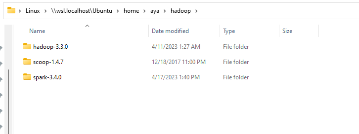


Nous aurons aussi besoin de `commons-lang-2.6.jar `, elle nous permettra de convertir les données en UTF-8.

`mysql-connector-java-5.1.48.jar` et `commons-lang-2.6.jar` sont à placer dans le dossier `sqoop/lib`.

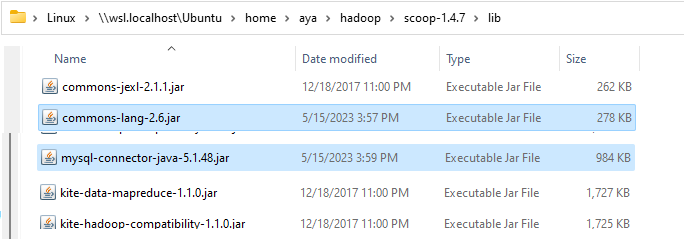


1. Télécharger SQOOP depuis le site officiel version 1.4.7
2. Décompresser le fichier dans le dossier `/home/aya/hadoop/sqoop-1.4.7`
3. Modifier le fichier `.bashrc` en ajoutant les lignes suivantes :
```
export SQOOP_HOME=/home/aya/hadoop/sqoop-1.4.7
export PATH=$PATH:$SQOOP_HOME/bin
```
4. Modifier le fichier `sqoop-env.sh` en ajoutant les lignes suivantes :
```
export HADOOP_COMMON_HOME=/home/aya/hadoop/hadoop-3.3.0
export HADOOP_MAPRED_HOME=/home/aya/hadoop/hadoop-3.3.0
```
5. Finalement redémarrer le terminal et vérifier que SQOOP est bien installé en tapant la commande `sqoop version`
````bash
aya@aya-laptop:~/hadoop/scoop-1.4.7/bin$ /home/aya/hadoop/scoop-1.4.7/bin/sqoop version
````
Le résultat devrait être le suivant : [Sqoop 1.4.7](https://sqoop.apache.org/docs/1.4.7/SqoopUserGuide.html)
````bash
Warning: /home/aya/hadoop/scoop-1.4.7/bin/../../hbase does not exist! HBase imports will fail.
Please set $HBASE_HOME to the root of your HBase installation.
Warning: /home/aya/hadoop/scoop-1.4.7/bin/../../hcatalog does not exist! HCatalog jobs will fail.
Please set $HCAT_HOME to the root of your HCatalog installation.
Warning: /home/aya/hadoop/scoop-1.4.7/bin/../../accumulo does not exist! Accumulo imports will fail.
Please set $ACCUMULO_HOME to the root of your Accumulo installation.
Warning: /home/aya/hadoop/scoop-1.4.7/bin/../../zookeeper does not exist! Accumulo imports will fail.
Please set $ZOOKEEPER_HOME to the root of your Zookeeper installation.
2023-05-15 19:17:50,070 INFO sqoop.Sqoop: Running Sqoop version: 1.4.7
Sqoop 1.4.7
git commit id 2328971411f57f0cb683dfb79d19d4d19d185dd8
Compiled by maugli on Thu Dec 21 15:59:58 STD 2017
````

## Création de la base de données

Sur Windows, on démarre XAMPP et on lance Apache et MySQL.

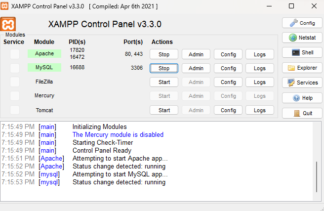

On crée la base de donnée `db_spark` qui contient la table `Employees`.

````sql
Create database db_spark;
Use db_spark;
CREATE TABLE `employees` (
  `ID` int(11) NOT NULL,
  `FirstName` varchar(60) NOT NULL,
  `LastName` varchar(60) NOT NULL,
  `CINE` varchar(60) NOT NULL
) ENGINE=InnoDB DEFAULT CHARSET=utf8mb4 COLLATE=utf8mb4_general_ci;
ALTER TABLE `employees`
    ADD PRIMARY KEY (`ID`);
ALTER TABLE `employees`
    MODIFY `ID` int(11) NOT NULL AUTO_INCREMENT, AUTO_INCREMENT=3;
COMMIT;
````

On insère des données dans la table `Employees`.

````sql
INSERT INTO `employees` (`ID`, `FirstName`, `LastName`, `CINE`) VALUES
(1, 'Aba', 'Ana', 'EE909090'),
(2, 'Aca', 'Ana', 'EE808080');
````

On obtient le résultat suivant :

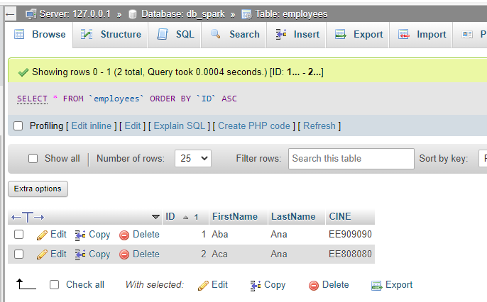

## Importer les données de MySQL vers HDFS

Il faut identifier l'adresse IP de la machine Windows, pour cela on utilise la commande `ipconfig` dans le terminal Windows.

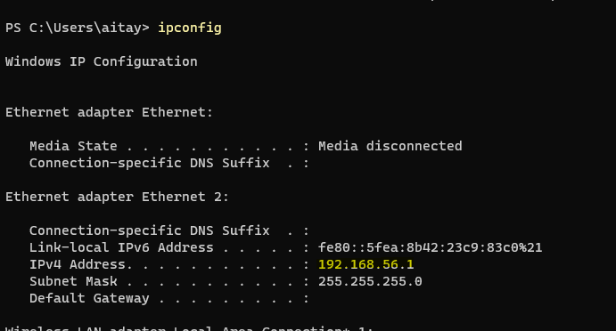

Donc l'adresse IP de notre base de données est `192.168.56.1:3306`.

On utilise la commande `sqoop import` pour importer les données de MySQL vers HDFS.

````bash
sqoop import --connect jdbc:mysql://192.168.56.1:3306/dp-spark --username root --password '' --table employees --target-dir /user/aya/hadoop/data/employees
````

Si tout se passe bien, on obtient le résultat suivant :

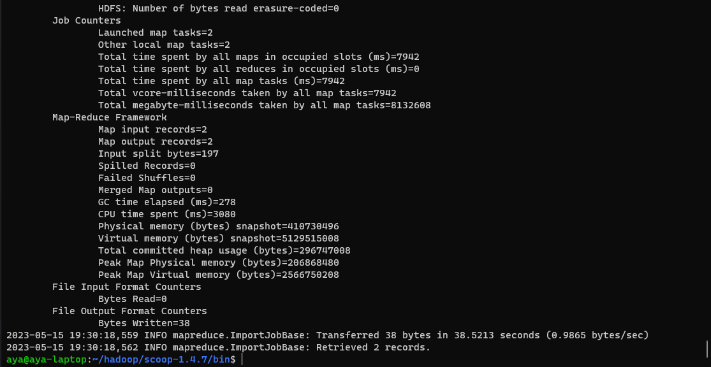

On accède à HDFS pour vérifier que les données ont bien été importées.

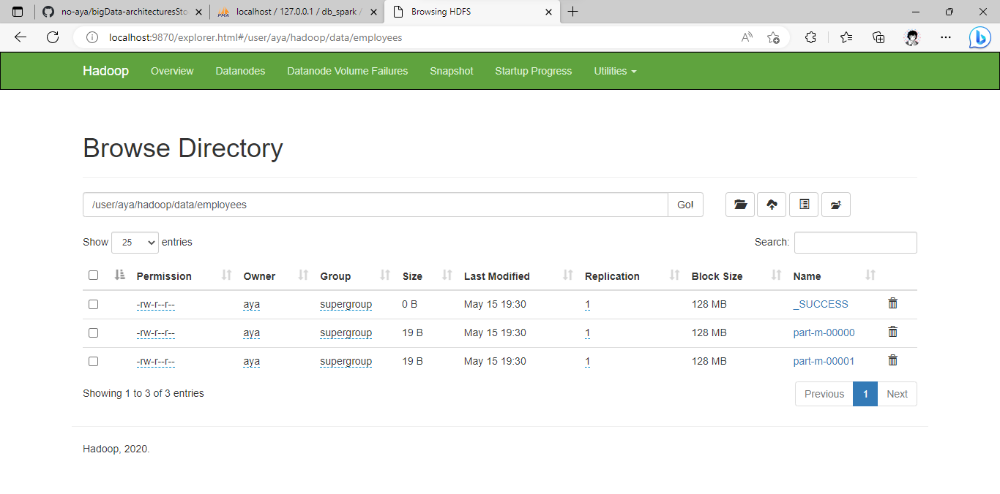

Chaque fichier contient une entrée de la table `employees`.

## Importer les données de HDFS vers MySQL

On crée une liste d'enregistrements dans un fichier texte.

````bash
nano employees.txt
````

Dans le fichier `employees` on ajoute les enregistrements suivants :

````text
3,Ada,Ana,EE707070
4,Afa,Ana,EE606060
5,Aga,Ana,EE505050
6,Aha,Ana,EE404040
````

Si le dossier source contient déjà des fichiers, on vide le dossier avant de transférer le fichier `employees.txt`.

````bash
$HADOOP_HOME/bin/hadoop fs -rm /user/aya/hadoop/data/employees/*
````
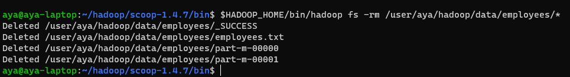

On transfère le fichier `employees` vers HDFS.

````bash
$HADOOP_HOME/bin/hadoop fs -put employees.txt /user/aya/hadoop/data/employees
````
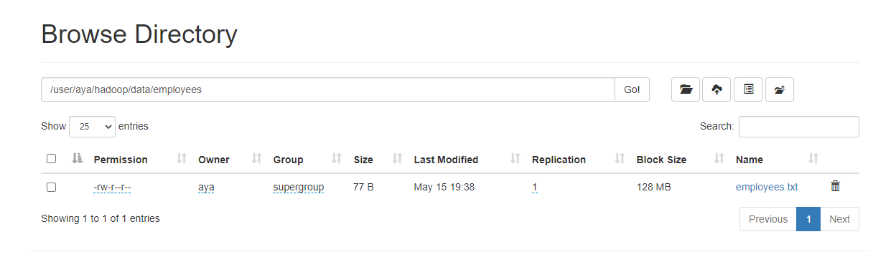


On utilise la commande `sqoop export` pour importer les données de HDFS vers MySQL.

````bash
sqoop export --connect jdbc:mysql://192.168.56.1:3306/db_spark --username root --password '' --table employees --export-dir /user/aya/hadoop/data/employees --input-fields-terminated-by ',' --input-lines-terminated-by '\n' 
````

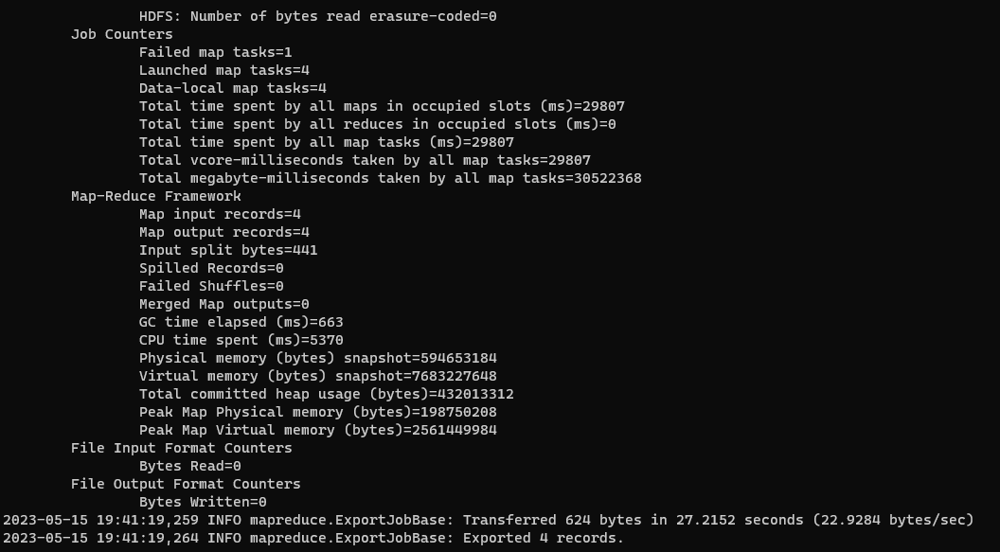

Le résultat doit figurer dans la table `employees` de la base de données `db_spark`.

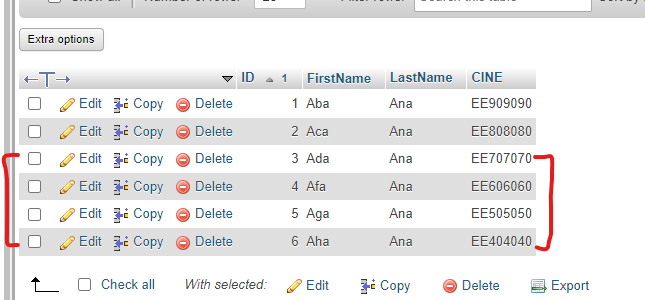


---


