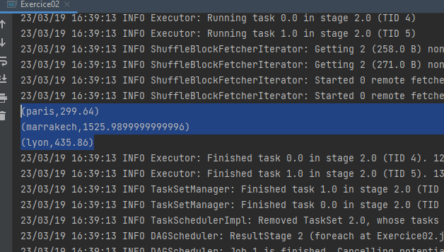
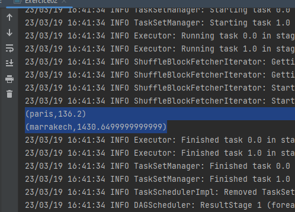
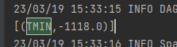
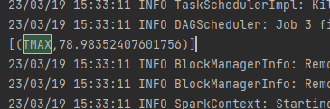
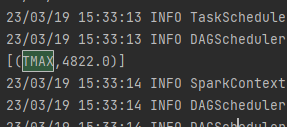
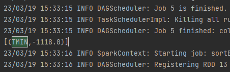
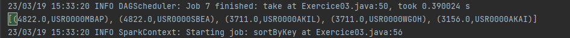
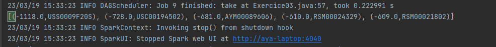

# Traitement parallèle et distribué avec Spark
## Exercice 1 : Reproduire le schéma de données
On initialise un projet Spark avec les données suivantes dans un RDD.
```java
SparkConf conf = new SparkConf();
conf.setAppName("Exercice 01").setMaster("local[*]");
JavaSparkContext sc = new JavaSparkContext(conf);
List<String> list = Arrays.asList("aya","aya2","aya3","aya4","aya5","aya6","aya7","aya8","aya9","aya10","aya11","aya12","aya13","aya14","aya15","aya16","aya17","aya18","aya19","aya20","aya21","aya22","aya23","aya24","aya25","aya26","aya27","aya28","aya29","aya30","aya31","aya32","aya33","aya34","aya35","aya36","aya37","aya38","aya39","aya40","aya41","aya42","aya43","aya44","aya45","aya46","aya47","aya48","aya49","aya50","aya51","aya52","aya53","aya54","aya55","aya56","aya57","aya58","aya59","aya60","aya61","aya62","aya63","aya64","aya65","aya66","aya67","aya68","aya69","aya70","aya71","aya72","aya73","aya74","aya75","aya76","aya77","aya78","aya79","aya80","aya81","aya82","aya83","aya84","aya85","aya86","aya87","aya88","aya89","aya90","aya91","aya92","aya93","aya94","aya95","aya96","aya97","aya98","aya99","aya100");
JavaRDD<String> rdd = sc.parallelize(list);
````
Puis on applique les transformations suivantes :
1.	Parallelize
```java
JavaRDD<String> rdd1 = sc.parallelize(list);
````
2.	Flatmap
```java
JavaRDD<String>  rdd2= rdd1.flatMap(s-> Arrays.asList(s).iterator());
System.out.println("*********** RDD2 *********** ");
rdd2.foreach(name-> System.out.print(name+"|"));
```
3.	Filter
```java
JavaRDD<String>  rdd3= rdd2.filter(s-> s.contains("aya"));
System.out.println("*********** RDD3/4/5 ***********");
System.out.print("Names that contains 'aya' : ");
rdd3.foreach(name-> System.out.println(name + " | "));
JavaRDD<String>  rdd4= rdd3.filter(s-> s.contains("1"));
System.out.println("Names that contains '1' : ");
rdd4.foreach(name-> System.out.println(name + " | "));

JavaRDD<String>  rdd5= rdd3.filter(s-> s.contains("2"));
System.out.println("Names that contains '2' : ");
rdd5.foreach(name-> System.out.println(name + " | "));
```
Résultat :
````
*********** RDD3/4/5 ***********
Names that contains 'aya' : 
aya |
aya2 |
aya3 |
...
aya99 |
aya100 |
Names that contains '1' :
aya1 |
aya11 |
aya21 |
...
aya91 |
aya101 |
Names that contains '2' :
aya2 |
aya12 |
aya22 |
...
aya92 |
aya102 |
````
4.	Union
```java
JavaRDD<String> rdd6= rdd3.union(rdd4);
System.out.println("*********** RDD6 ***********");
rdd6.foreach(name-> System.out.println(name + " | "));
```
Résultat :
````
*********** RDD6 ***********
aya |
aya2 |
aya3 |
...
aya99 |
aya100 |
aya1 |
aya11 |
aya21 |
...
aya91 |
aya101 |
````
5.	Map
```java
 JavaRDD<String> rdd71= rdd5.map(s-> s.toUpperCase());
System.out.println("*********** RDD71 ***********");
rdd71.foreach(name-> System.out.println(name + " | "));
JavaRDD<String> rdd81= rdd6.map(s-> s.toLowerCase());
System.out.println("*********** RDD81 ***********");
rdd81.foreach(name-> System.out.println(name + " | "));
```
Résultat :
````
*********** RDD71 ***********
AYA2 |
AYA12 |
AYA22 |
...
AYA92 |
AYA102 |
*********** RDD81 ***********
aya |
aya2 |
aya3 |
...
aya99 |
aya100 |
aya1 |
aya11 |
aya21 |
...
aya91 |
aya101 |
````
6.	ReduceByKey
```java
 JavaPairRDD<String,Integer> rdd7 = rdd71.mapToPair((name)->new Tuple2<>(name,1));
System.out.println("*********** RDD7 ***********");
rdd7.foreach((name)-> System.out.println(name));

JavaPairRDD<String,Integer> rdd8 = rdd81.mapToPair((name)->new Tuple2<>(name,1));
System.out.println("*********** RDD8 ***********");
rdd8.foreach((name)-> System.out.println(name));
```
Résultat :
````
*********** RDD7 ***********
(AYA2,1)
(AYA12,1)
(AYA22,1)
...
(AYA92,1)
(AYA102,1)
*********** RDD8 ***********
(aya,1)    
````
7.	Union
```java
JavaPairRDD<String,Integer> rdd9 = rdd7.union(rdd8);
System.out.println("*********** RDD9 ***********");
rdd9.foreach((name)-> System.out.println(name));
```
Résultat :
````
*********** RDD9 ***********
(AYA2,1)
(AYA12,1)
(AYA22,1)
...
(AYA92,1)
(AYA102,1)
(aya,1)
````

8.	SortBy
```java
JavaPairRDD<String,Integer> rdd10 = rdd9.sortByKey();
System.out.println("*********** RDD10 ***********");
rdd10.foreach((name)-> System.out.println(name));
```
Résultat :
````
*********** RDD10 ***********
(AYA1,1)
(AYA10,1)
(AYA100,1)
...
(AYA9,1)
(AYA90,1)
(AYA91,1)
...
(AYA99,1)
(aya,1)
````
## Exercice 2 : Gestions des ventes
Dans cet exercice, nous allons utiliser les données du fichier ventes.txt.
### 1.	Total des ventes par ville
```java
public void totalParVille(){
        //Spark
        SparkConf conf = new SparkConf();
        conf.setAppName("Exercice 02").setMaster("local[*]");
        JavaSparkContext sc = new JavaSparkContext(conf);
        JavaRDD<String> sourceRDD=sc.textFile("src/main/resources/ventes.txt");

        //Affichage du contenu du fichier source
        sourceRDD.foreach(entry-> System.out.println(entry));

        //Mappe le fichier source en un RDD de tuple (ville, montant)
        JavaPairRDD<String,Double> rdd1 = sourceRDD.mapToPair(entry->{
            String[] split = entry.split(" ");
            return new Tuple2<>(split[1],Double.valueOf(split[3]));
        });

        //Summe les montants par ville
        JavaPairRDD<String,Double> rdd2 = rdd1.reduceByKey((a, b)->a+b);

        //Affichage du résultat
        rdd2.foreach(entry-> System.out.println(entry));

        //End spark
        sc.stop();
}
```
Résultat :
````
Sommes des ventes par ville : 
(paris,299.64)
(marrakech,1525.9899999999996)
(lyon,435.86)
````

### 2. Total des ventes par ville pour une année donnée
```java
public void totalParVille(String annee){
        SparkConf conf = new SparkConf();
        conf.setAppName("Exercice 02").setMaster("local[*]");
        JavaSparkContext sc = new JavaSparkContext(conf);
        JavaRDD<String> sourceRDD=sc.textFile("src/main/resources/ventes.txt");

        JavaPairRDD<String,Double> rdd1 = sourceRDD.mapToPair(entry->{
        String[] split = entry.split(" ");
        String[] date = split[0].split("/");
        if(date[2].equals(annee))
        return new Tuple2<>(split[1],Double.valueOf(split[3]));
        else
        return new Tuple2<>("",0.0);
        });

        JavaPairRDD<String,Double> rdd2 = rdd1.reduceByKey((a, b)->a+b);

        //Affichage du résultat et suppression des lignes vides
        rdd2.filter(entry->!entry._1.equals("")).foreach(entry-> System.out.println(entry));

        }
```
Résultat :
````
Sommes des ventes par ville pour l'année 2001 :
(paris,136.2)
(marrakech,1430.6499999999999)
````


## Exercice 3 : Statistiques météo
Dans cet exercice, nous allons utiliser les données météo de la ville de Paris pour calculer des statistiques sur les températures minimales et maximales. Le jeu de données est mis à la disposition du public par le NCEI.

Il est disponible à l'adresse suivante : https://www1.ncdc.noaa.gov/pub/data/ghcn/daily/by_year/2023.csv.gz

On initialise un projet Spark en Scala et on charge le jeu de données dans un RDD.
````java
SparkConf conf = new SparkConf();
conf.setAppName("Exercice03").setMaster("local[*]");
JavaSparkContext sc = new JavaSparkContext(conf);
JavaRDD<String> meteo= sc.textFile("src/main/resources/2023.csv");
````
### Température minimale moyenne
On crée une paire clé/valeur avec le type de donnée comme clé et la température minimale comme valeur.
````java
JavaPairRDD<String, Double> Temp = meteo.mapToPair(ligne -> new Tuple2<>(ligne.split(",")[2], Double.parseDouble(ligne.split(",")[3])));
````
Puis on filtre les données pour ne garder que les températures minimales.
````java
JavaPairRDD<String,Double> Tmin = Temp.filter(x -> x._1.equals("TMIN"));
Long taille = Tmin.count();
JavaPairRDD<String, Double> Tmin_som = Tmin.reduceByKey((x, y) -> x + y);
JavaPairRDD<String, Double> Tmin_moy = Tmin_som.mapValues(x -> x/taille);
System.out.println(Tmin_moy.collect());
````
Le résultat est le suivant :
````
[(TMIN,-22.08005065201681)]
````


### Température maximale moyenne
On crée une paire clé/valeur avec le type de donnée comme clé et la température maximale comme valeur.
````java
JavaPairRDD<String,Double> Tmax = Temp.filter(x -> x._1.equals("TMAX"));
Long taille1 = Tmax.count();
JavaPairRDD<String, Double> Tmax_som = Tmax.reduceByKey((x, y) -> x + y);
JavaPairRDD<String, Double> Tmax_moy = Tmax_som.mapValues(x -> x/taille1);
System.out.println(Tmax_moy.collect());
````
Le résultat est le suivant :
````
[(TMAX,78.98352407601756)]
````

### Température maximale la plus élevée
On reprend la paire clé/valeur avec le type de donnée comme clé et la température maximale comme valeur.
Puis on filtre les données pour ne garder que les températures maximales.
ReduceByKey permet de réduire les données en une seule paire clé/valeur.
````java
JavaPairRDD<String, Double> Tmax2 = Tmax.reduceByKey((x, y) -> Math.max(x,y));
System.out.println(Tmax2.collect());
````
Le résultat est le suivant :
````
[(TMAX,4822.0)]
````


### Température minimale la plus basse
On reprend la paire clé/valeur avec le type de donnée comme clé et la température minimale comme valeur.
Puis on filtre les données pour ne garder que les températures minimales.
ReduceByKey permet de réduire les données en une seule paire clé/valeur.
````java
JavaPairRDD<String, Double> Tmin2 = Tmin.reduceByKey((x, y) -> Math.min(x,y));
System.out.println(Tmin2.collect());
````
Le résultat est le suivant :
````
[(TMIN,-1118.0)]
````


### Top 5 des stations météo les plus chaudes
Pour cette partie nous allons créer des Tuple à 3 éléments. Le premier élément est le nom de la station, le deuxième est le type de donnée et le troisième est la température.
````java
JavaPairRDD<Tuple3<String, String, Double>, Integer> Top5 = meteo.mapToPair(ligne -> new Tuple2<>(new Tuple3<>(ligne.split(",")[0], ligne.split(",")[2], Double.parseDouble(ligne.split(",")[3])), 1));
````
Maintenant on peut filtrer les données pour ne garder que les températures maximales.
````java
JavaPairRDD<Tuple3<String, String, Double>, Integer> Top5_1 = Top5.filter(x -> x._1._2().equals("TMAX"));
````
On peut maintenant réduire les données en une seule paire clé/valeur.
````java
JavaPairRDD<Tuple3<String, String, Double>, Integer> Top5_2 = Top5_1.reduceByKey((x, y) -> x + y);
````
On peut maintenant trier les données par ordre décroissant.
````java
JavaPairRDD<Tuple3<String, String, Double>, Integer> Top5_3 = Top5_2.sortByKey(false);
````
On peut maintenant afficher les 5 premières données.
````java
System.out.println(Top5_3.take(5));
````
Le résultat est :
```
[(4822.0,USR0000MBAP), (4822.0,USR0000SBEA), (3711.0,USR0000AKIL), (3711.0,USR0000WGOH), (3156.0,USR0000AKAI)]
````



### Top 5 des stations météo les plus froides
Même procédé que pour la partie précédente.
````java
JavaPairRDD<Tuple3<String, String, Double>, Integer> Top5_4 = Top5.filter(x -> x._1._2().equals("TMIN"));
JavaPairRDD<Tuple3<String, String, Double>, Integer> Top5_5 = Top5_4.reduceByKey((x, y) -> x + y);
JavaPairRDD<Tuple3<String, String, Double>, Integer> Top5_6 = Top5_5.sortByKey(true);
System.out.println(Top5_6.take(5));
````
Le résultat est :
```
[(-1118.0,USS0009F20S), (-728.0,USC00194502), (-681.0,AYM00089606), (-610.0,RSM00024329), (-609.0,RSM00021802)]
````


